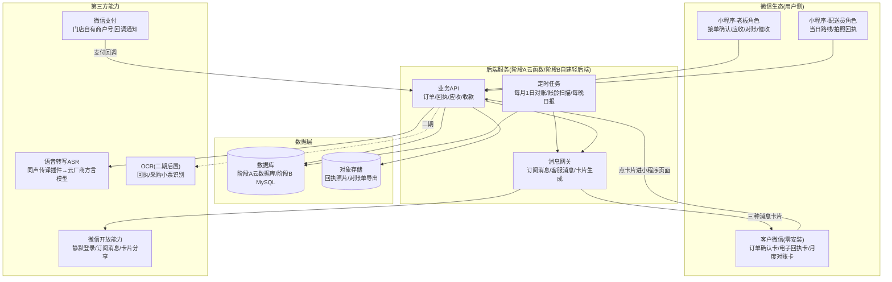
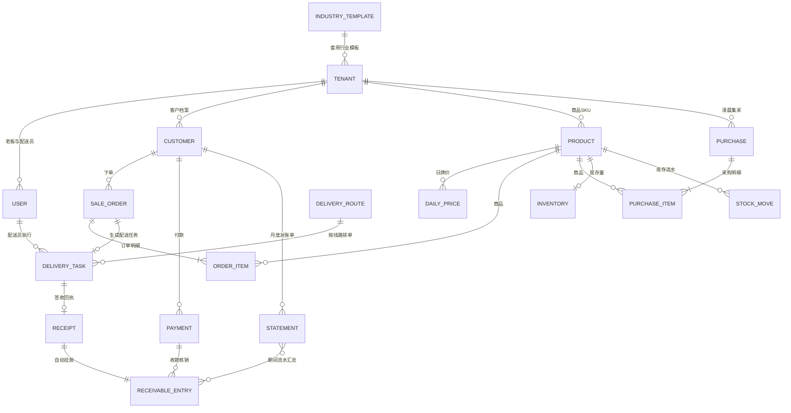
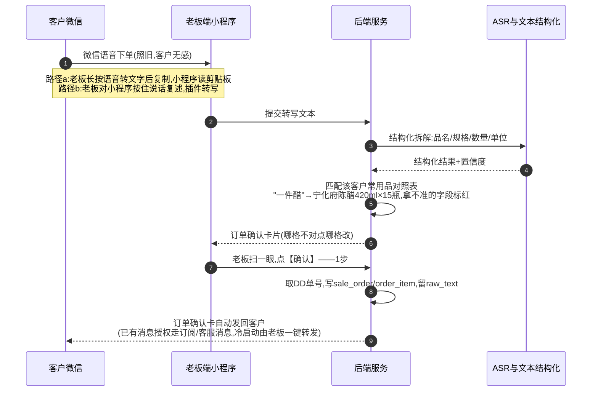
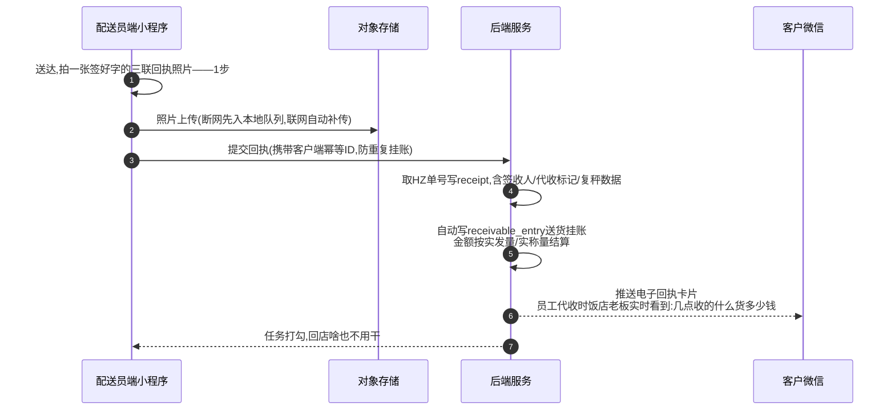
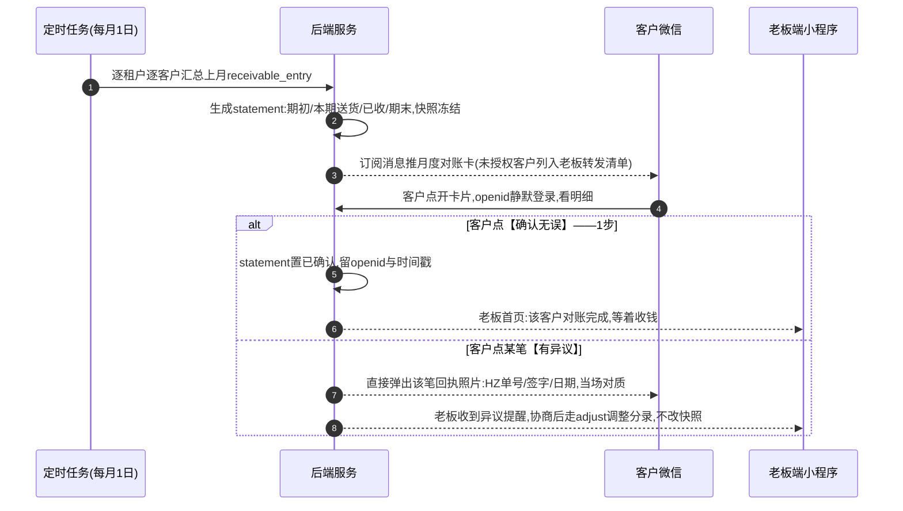
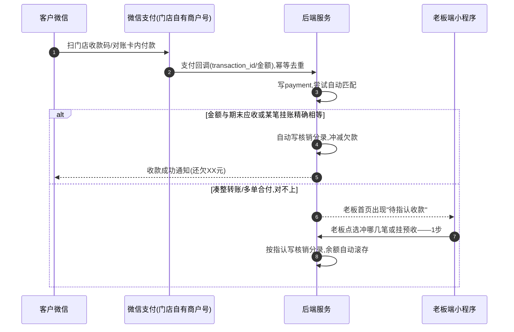

# 02-系统方案设计

> 本篇是产品化(《docs/09》模式2:轻量SaaS)的系统技术方案,写给承接开发的工程师/外包团队,也让方案持有者看懂每一分钱花在哪。业务语义以 docs/01~10 为准,交互遵守《docs/10》三条铁律:语音优先、一件事不超过1步点击、算账全自动。行业模板的抽象细节由《design/03-可扩展性与行业模板.md》负责,本篇只在架构与数据模型上把扩展点预留到位。文中所有金额与工作量均为(示例),以实际报价为准。

## 一、总体架构

产品形态是**一个微信小程序,两种登录角色**:老板(接单、看账、对账)与配送员(路线、拍回执)。客户(饭店老板)**零安装零注册**,只在自己微信里收三种消息卡片:订单确认卡、电子回执卡、月度对账卡。一个"租户"=一家配送门店,多租户共用一套系统,按年订阅。

**客户端"零安装"靠什么实现**(这是《docs/10》第四节三条约束的技术落法):

1. **微信身份即账号**。客户点开任何一张卡片,进入的是小程序的一个轻页面,`wx.login` 静默拿到 openid 即完成"登录"——无注册、无密码、无手机号。首次点开时,系统把该 openid 绑定到这家门店的 customer 档案上,以后所有卡片都认人。
2. **触达走三条通道,层层兜底**。①老板/系统生成小程序分享卡片,老板在与客户的微信会话里**一键转发**——永远可用,不依赖任何授权,是冷启动兜底;②客户点过卡片后 48 小时内,可用客服消息主动推送(电子回执卡的主通道);③客户在卡片页顺手勾选一次订阅授权后,走**订阅消息**推送月度对账卡。微信对消息能力的规则会调整,消息网关做成独立模块,规则变了只改这一层。
3. **客户全程只有三个动作**:照旧发微信语音下单(他甚至不知道对面用了系统)、货到自动收到电子回执卡(顺带实现饭店老板对员工代收货的实时监督——《docs/09》说的独有传播钩子)、月底点一下【确认对账】。

## 二、技术选型(成本敏感,分两阶段)

选型只有一条总原则:**在 200 家租户之前,把固定成本压到接近零;在那之后,再为可控性付钱。**

### 阶段A(1~200家租户):微信小程序云开发

采用微信云开发的 Serverless 三件套:**云函数**(业务API+定时触发器)、**云数据库**(文档型)、**云存储**(回执照片)。

- **选它的理由**:免服务器、免运维、免域名备案(云函数直连小程序);登录态、订阅消息、微信支付都是"云调用"原生打通,省掉一整层鉴权对接;按量付费,起步每月几十到几百元(示例),一个人就能维护——与《docs/09》"小而美、不组大团队"的定位一致。
- **放弃项**:自购服务器起步(每月固定支出+运维人力,在没验证付费前是浪费);uni-app/Taro 跨端(本产品只活在微信里,跨端是伪需求)。
- **明确它的限制**(写进合同,避免后期扯皮):云数据库是文档型,复杂聚合与跨表事务能力弱于 MySQL,跨租户的运营报表吃力;深度绑定腾讯生态,迁出要自己写导出脚本;云函数有冷启动延迟(百毫秒级,对本产品可接受)。这些限制在 200 家租户内都不致命,换来的是近零的起步成本。

### 阶段B(租户增长后):迁移自建轻后端

- **目标架构**:Node.js(NestJS)+ MySQL 8 + 对象存储(COS/OSS)+ 一台 2核4G 云服务器起步(示例:每月百元级)。选 Node 是因为与小程序端同为 JS 技术栈,1~2 人团队不用切语言;Python(FastAPI)为备选,团队更熟哪个用哪个。放弃 Java/Spring(对两人团队过重)、放弃 K8s/微服务(几百租户的量,一台单体+一台备机足够)。
- **迁移触发条件**(满足其一即启动):租户超过 200 家;云开发月账单连续 3 个月超过自建等价成本(示例:约 500 元/月);出现云数据库做不动的需求(复杂对账报表、跨租户运营后台、行业模板高级查询)。
- **迁移策略**:从第一天起,小程序端所有请求走统一的 API 封装层,不直连云数据库——底层从云函数切到 HTTP 接口时前端基本不改。迁移时按租户分批:导出该租户全量数据→导入 MySQL→**双写过渡 2~4 周**(新旧两库同时写、以旧库为准比对)→比对无差后切读、停旧写。租户无感知,选在月初对账完成后的窗口执行。

### 语音转写与OCR

- **ASR 起步用微信同声传译插件**(小程序官方插件,起步成本约为零),用于老板对小程序"复述下单"的路径;文本结构化(品名/数量/单位拆解)自研规则+常用品对照表,不依赖大模型。
- **增强期切云厂商 ASR**(腾讯云/讯飞等,支持**北方方言模型**),按量计费(示例:每次一句话识别约几厘到一分钱)。ASR 做成可替换的适配层,哪家准用哪家。
- **必须向工程师讲清一个微信边界**:小程序**拿不到客户发在微信聊天里的语音文件**。所以接单有两条现实路径——路径a:老板在聊天里长按语音"转文字",复制后切到小程序,小程序读剪贴板自动弹出识别结果;路径b:老板对着小程序按住说话复述一遍,由插件转写。两条都保留,老板用哪条顺手用哪条。
- **拍照回执 OCR(识别手写数量/签名)列为二期后置项**:MVP 阶段照片只存证不识别,人眼核对已经够用,不为锦上添花的识别先付钱。

## 三、数据模型(核心章节)

### 1. ER 总览

除 industry_template 外,**所有表都带 tenant_id**,ER 图中不再逐一画出。`order` 是 SQL 保留字,建表名用 `sale_order`。

### 2. 逐表说明字段要点

**基础与配置**

- **industry_template(行业模板)**:`code`(seasoning_grain 调味粮油/seafood 海鲜水产/vegetable 蔬菜/frozen 冻品)、`name`、`version`、`config JSON`。config 内含:品类树、单位表、计价方式集合、双数量字段开关、单据字段集、流程开关(库存/每日报价/复秤确认)、界面词表、打印模板。结构定义详见《design/03-可扩展性与行业模板.md》,本篇数据模型保证:凡是模板开关控制的表(daily_price、inventory、复秤字段),代码里都按开关取用,关掉即隐藏,不留死路。
- **tenant(租户=一家门店)**:`name`、`industry_template_id`、`region`、`plan`(基础版/专业版)、`expire_at`(订阅到期)、`settings JSON`(租户级覆盖模板默认值,如截单时间、回执抬头店名)、`status`。到期只读不删——数据留存是续费的根(《docs/09》)。
- **user(登录用户)**:`tenant_id`、`openid`、`role`(owner 老板/driver 配送员)、`name`、`phone`、`status`。同一个小程序按 role 渲染两套首页;一个 openid 只属一个租户。

**客户与商品**

- **customer(客户档案)**:`name`(店名)、`grade`(A/B/C 分级)、`credit_limit`(赊账上限,超线开单时拦截提示)、`settle_type`(月结/现结)、`contact_openid`(客户首次点卡片后绑定,可空)、`route_id`(所属配送线路)、`alias_map JSON`(**常用品对照表**:"一件醋"→SKU+换算数量,语音结构化的命中依据,《docs/02》第四节那张表的数字化)、`address`、`attributes JSON`。
- **product(商品SKU)**:`name`、`spec`、`unit`、`price_mode`(fixed 固定单价/daily 日牌价/negotiated 时价面议)、`sale_price`、`purchase_price`(**配送员角色不可见**)、`weighable`(可称重标志,决定明细是否启用实称量)、`safety_stock`、`attributes JSON`(行业差异字段,如海鲜的条重规格)、`status`。
- **daily_price(日牌价)**:`product_id`、`price_date`、`price`、`created_by`,唯一键(tenant_id, product_id, price_date)。仅当模板开关开启时启用;当日未报价则回落 sale_price。历史单据存价格快照,改牌价不追溯旧单。

**订单与履约**

- **sale_order(订单)**:`customer_id`、`order_no`(DD+年月日+2位序号,延续《docs/07》纸质编号规则,租户内当日自增取号防并发重号)、`order_date`、`source`(voice/manual/接龙)、`raw_text`(转写原文留档备查)、`status`(待确认/已确认/已配送/已作废)、`total_amount`、`confirmed_at`。
- **order_item(订单明细)**:`product_id`、`qty_ordered`(**下单量**)、`qty_actual`(**实发量/实称量**,双数量字段由模板开关控制展示;结算金额一律按 qty_actual)、`unit`、`unit_price`(下单时价格快照)、`price_mode_snapshot`、`amount`、`memo`。
- **purchase / purchase_item(采购)**:purchase 记一次清晨集采(`purchase_date`、`market`、`total_amount`);purchase_item 记到摊位(`product_id`、`qty`、`unit_cost`、`stall`)。采购汇总单=昨日订单聚合-现库存,由函数生成,不落中间表。
- **delivery_route / delivery_task(线路与配送任务)**:route 是固定线路(`name`、`sort`);task 是"某订单某天由某配送员送"(`order_id`、`driver_user_id`、`task_date`、`seq` 线路内顺序、`status` 待送/已送/失败、`delivered_at`)。配送员首页就是当日 task 列表。
- **receipt(回执,全系统的凭证核心)**:`delivery_task_id`、`receipt_no`(HZ+年月日+2位序号)、`photo_urls JSON`(对象存储地址,可多张)、`signer`(签收人)、`sign_type`(本人/代收——代收即触发给饭店老板的实时通知)、`reweigh_data JSON`(复秤数据,模板开关)、`amount`、`created_at`。**回执创建后不可修改,只能作废重开**,作废留痕。

**资金与账务**

- **receivable_entry(应收流水,只追加不修改)**:`customer_id`、`entry_type`(delivery 送货挂账+ / payment 收款核销- / adjust 调整±)、`amount`、`ref_type`+`ref_id`(指向 receipt 或 payment,张张有据)、`biz_date`、`memo`。客户当前欠款=流水求和,不单存余额字段,杜绝"改余额"这种糊涂账。
- **payment(收款)**:`customer_id`、`amount`、`method`(微信支付/转账/现金)、`wxpay_transaction_id`(支付回调唯一号,幂等去重)、`pay_time`、`match_status`(自动核销/待指认/已指认)。
- **statement(月度对账单)**:`customer_id`、`period`(如 202607)、`opening_balance` 期初、`period_delivery` 本期送货、`period_paid` 本期已收、`closing_balance` 期末、`status`(待确认/已确认/有异议)、`confirmed_at`、`confirm_openid`(谁点的确认,留证)、`dispute_memo`。生成即快照冻结;异议处理不改快照,走 adjust 调整分录进下期。

**库存(模板开关控制)**

- **inventory(现存量)**:`product_id`、`qty`,是 stock_move 的物化结果。
- **stock_move(库存流水)**:`product_id`、`move_type`(采购入/销售出/盘点调整)、`qty ±`、`ref_type/ref_id`、`biz_date`。开关关闭的租户(如纯代采不囤货)完全不写这两张表。

### 3. 扩展字段策略

**固定核心列 + attributes JSON** 两层:凡是所有行业共有、要参与索引和算账的字段(数量、金额、单价、状态、日期)一律固定列;行业差异字段(海鲜条重、冻品批号、蔬菜产地)进 `attributes JSON`,后端不解释、只透传,前端按行业模板的**界面词表**渲染标签。单据打印模板(回执/对账单的蓝牙小票与图片版式)以 JSON 描述字段布局与抬头,存于 industry_template.config,租户 settings 可覆盖店名与落款——新行业接入只改配置不改表结构,这是对《design/03》的接口承诺。

## 四、关键流程时序

### 1. 语音下单 → 订单卡片 → 老板1步确认

### 2. 配送拍照回执 → 自动挂应收 → 客户收电子回执卡

### 3. 每月1日自动对账 → 客户确认/异议定位回执照片

### 4. 微信支付收款 → 自动核销(凑整转账人工指认兜底)

对应《docs/10》的边界:催收只自动提示、不自动发送;价格永远手动调,系统不做任何自动调价。

## 五、非功能设计

- **多租户数据隔离**:所有业务表 tenant_id 贯穿,索引一律以 tenant_id 为前缀。阶段A用云数据库安全规则+云函数内强制注入 tenant_id;阶段B在 DAO 层统一拦截,任何查询不带 tenant_id 直接抛错,禁止手写裸 SQL 绕过。租户间互相不可见是底线,一次串数据事故就是产品死刑。
- **弱网与离线**(县城信号差是常态,《docs/07》选型清单的硬指标):订单草稿、当日路线本地缓存,进店无网也能看;回执照片先写本地队列并标"待上传",联网自动补传;所有写操作携带客户端生成的幂等ID,补传重试不产生重复挂账。
- **数据安全与备份**:数据库每日自动备份(云开发自带/阶段B mysqldump 推异地对象存储),保留 30 天;回执照片对象存储开版本控制。**租户数据导出是产品承诺**:老板随时一键导出全量 Excel(商品/客户/单据/应收)——《docs/07》立的规矩"不能导出的软件坚决不用",我们自己先做到,数据主权归门店。
- **权限三级**:老板(全功能,唯一能看进价与毛利、能改价、能做调整分录);配送员(仅当日路线与拍回执,**屏蔽进价毛利**);客户(仅凭 openid 看自己那家的卡片页,无登录界面)。
- **审计留痕**:audit_log 记录账目相关表(receipt/receivable_entry/payment/statement/order 金额字段)的每次变更:谁、何时、改前改后值。回执与应收流水**只追加、只红冲、不物理删除**。赊销生意,账的可信是命——客户和老板任何一方对账目起疑,系统要能把历史一笔笔摊开。

## 六、开发路线与工作量估算(均为示例)

| 期次 | 范围 | 工作量(示例) | 验收标准 |
|---|---|---|---|
| MVP | 双角色小程序框架;点选开单;回执拍照自动挂账;应收看板;每月1日对账单生成+卡片推送+客户确认;数据导出 | 8~10周,1~2人 | 一家真实门店连续跑通一个自然月:月末对账零手工翻单;配送员账号看不到进价;断网拍回执联网后补传成功;全量数据可一键导出Excel |
| 二期 | 语音结构化(插件ASR+常用品对照表+标红确认);采购汇总一键生成;库存与流水;账龄催收提醒;微信支付回调自动核销 | 6~8周 | 语音到确认卡片10秒内;采购汇总单3秒生成;支付自动核销率≥80%(示例),其余进待指认;催收只提示、老板点了才发 |
| 三期 | 行业模板配置化开放(打通industry_template全部开关);日牌价;复秤确认;打印模板可配;回执OCR评估 | 6~8周 | 新行业租户零代码开通(选模板+改词表即可);日牌价当日生效且历史单据价格不变;复秤差异自动生成调整分录并留痕 |

每期结束都以**真实门店实测**为验收,不以功能演示为验收;MVP 先不做语音——先把"账"这条命脉跑通,语音是效率增强,顺序不能反。

## 七、成本测算(全部为示例,以官方与厂商实时报价为准)

| 项目 | 金额(示例) | 说明 |
|---|---|---|
| 阶段A云开发 | 约20~500元/月 | 基础套餐约20元/月起,随租户数按量增长;200家租户内预计不超过500元/月 |
| ASR按量费用 | 每租户约1~5元/月 | 同声传译插件起步近零;云厂商一句话识别约每次几厘到一分钱×日均几十单 |
| 对象存储 | 每租户约0.3~1元/月 | 日均30张回执照片×300KB,年约3GB,存储+CDN流量 |
| 微信认证 | 小程序300元/年+服务号300元/年 | 微信官方年审费;用支付与订阅消息必须认证 |
| 微信支付手续费 | 费率约0.6% | 由门店自有商户号/收款码承担,**资金不经平台账户**——平台只记账不碰钱,规避二清合规风险(呼应《docs/08》) |
| 蓝牙打印机适配 | 一次性开发投入;硬件200~400元/台 | 小程序BLE直连ESC/POS指令打印,选定1~2个主流型号适配;硬件按成本价搭售不赚差价(《docs/09》) |
| 阶段B自建 | 约200~400元/月 | 2核4G服务器+MySQL+对象存储+备份,迁移时点才发生 |

**毛利结构对照《docs/09》定价(365~998元/年,示例)**:单租户的边际云成本约 20~70 元/年(示例),对基础版 365 元/年毛利仍在 80%~95%;平台侧固定成本(双认证 600 元/年+云开发底座)不到 10 家付费租户即可摊平。按《docs/09》单位经济:150~300 家×客单 600 元 = 年收入 9 万~18 万(示例),对应云侧总成本约几千元/年(示例)——**收入是年费预收、成本按量后付,现金流为正**。这套账成立的前提正是本篇的两阶段选型:在验证期不背任何固定的服务器与人力成本,租户涨到哪一档,成本才跟到哪一档。

---

**一句话压住本篇**:一个小程序两种角色、客户零安装只收卡片;云开发起步把月成本压到几百元内、200家后迁自建;数据模型以"回执为凭、流水为账、快照对账、改动留痕"为骨,行业差异全部推到模板配置层——钱只花在账算得清、货送得明这两件事上。
