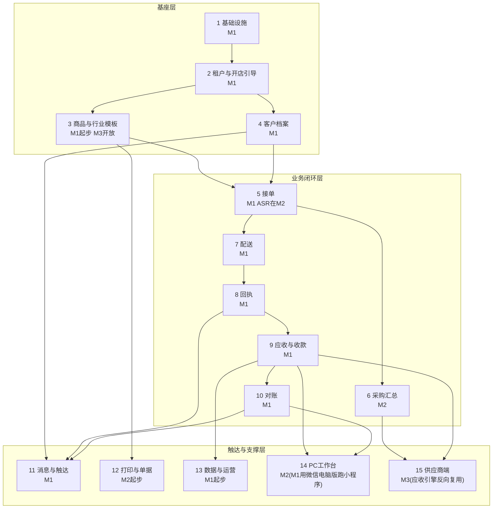

# 06-功能拆解与实现计划

**这篇是什么:** 依据《design/05-设计优化方案》修订后的设计,把产品拆到可排期的开发任务粒度,并落成带验收门禁的里程碑计划。读者是承接开发的 1~2 人团队(或小外包)与方案持有者。三条执行纪律先立住:**凡 05 已降级的承诺,本篇不复活**(不做自动推送、不承诺自动核销率、不写"实时接单");**账务内核四件事(取号、核销分配、物化余额、对账幂等)定稿并通过压测之前,不写业务功能的第一行代码**;**每个里程碑以真实门店实测为验收,不以功能演示为验收**。文中工时与金额凡不确定处均标(示例)。

## 一、拆解总览

十五个模块,按"基座→业务闭环→触达与支撑"三层组织。依赖关系与首次交付里程碑如下:

读图要点:接单→配送→回执→应收→对账是唯一的主干,其余模块全部为这条"账的凭据链"服务;模块 6(采购汇总)和模块 12(打印)不在 M1 主干上,刻意后置;模块 3 在 M1 只交付一个写死的调味粮油基准模板,配置化开放是 M3 的事。

## 二、逐模块功能拆解

优先级定义:**P0=MVP(M1)必须、P1=二期(M2)、P2=三期及以后(M3)**。子功能拆到"一个开发任务 2~5 天"的粒度(示例);验收标准均为可实测的一句话。

### 模块1 基础设施

| 功能 | 子功能 | 优先级 | 验收标准 | 依赖 |
|---|---|---|---|---|
| 取号服务 | counter 文档事务内自增+单号唯一索引冲突重试(上限5次)+序号4位 | P0 | 两客户端同秒各提交50单、多轮压测零重号 | 无 |
| 幂等 | 客户端幂等ID落唯一索引,重试先查命中即返原单 | P0 | 同一请求重放10次,库里只有1单 | 取号 |
| 弱网离线队列 | 草稿/照片本地队列、回网自动补传、"待上传"明示 | P0 | 断网拍回执,回网后照片与应收自动补齐、金额分毫不差 | 幂等 |
| 多租户隔离 | tenant_id 强制注入+安全规则+越权测试用例集 | P0 | 越权用例全部拦截,串租户查询为0 | 无 |
| audit_log | 金额相关表记改前改后值,只追加不删除 | P0 | 抽任意一笔改账,可还原谁、何时、改了什么 | 无 |
| 存储抽象 | photo_urls 从第一天存相对路径,读时拼接 | P0 | 切换存储域名不需重写任何存量文档 | 无 |

最容易做过头的地方:为"将来的 MySQL"提前铺双栈 ORM 与迁移框架——阶段 B 割接是 200 家租户时的事,现在只留"相对路径+API 封装层"两个钩子就够。

### 模块2 租户与开店引导

| 功能 | 子功能 | 优先级 | 验收标准 | 依赖 |
|---|---|---|---|---|
| 注册与角色 | 微信登录、老板/配送员双角色、邀请配送员 | P0 | 新老板5分钟内建号并邀请到1名配送员 | 模块1 |
| 开店三步 | 选模板→粘贴名单智能拆行建客户→品类树勾选录货,每步可跳过 | P0 | 3位陌生老板(含1位55岁+)无指导20分钟内走完并开出第一单 | 模块3、4 |
| 理老账(第四步) | 逐户录期初欠款→生成期初确认单(QC单号)→签字/卡片确认/7天默认,期初此后不可改 | P0 | 上线首月每户有期初确认记录(《design/07》三.缺口①) | 模块10 |
| 渐进解锁 | 前3天只开"开单+拍回执",累计确认≥10单(示例)放出账/客户tab | P0 | 新租户首日导航仅两项,达标后自动放开 | 开店三步 |
| 演示租户 | 预灌真实感数据的演示店,供地推与截图 | P1 | 地推现场一键进入演示店 | 开店三步 |
| 订阅到期 | plan/expire_at,到期只读不删、可导出 | P1 | 到期租户可看可导不可写 | 模块13 |

最容易做过头的地方:把引导流做成可配置的问卷引擎——三步写死就够,行业多了(M3)再抽象。

### 模块3 商品与行业模板

| 功能 | 子功能 | 优先级 | 验收标准 | 依赖 |
|---|---|---|---|---|
| SKU 管理 | 增删改查、price_mode、进价字段配送员端不可见 | P0 | 配送员账号任意页面与接口均无进价字段 | 模块1 |
| 品类树与单位 | 基准模板预置品类树,勾选+改价批量建SKU | P0 | 勾选建50个SKU≤10分钟 | SKU |
| 词表 | 基准词表落全部界面文案;禁用词扫描脚本进发版检查单 | P0 | 发版前扫描零禁用词,否则不许发 | 无 |
| config 三层合并 | 六维度拆6个子文档、各带版本,官方默认<模板版本<租户diff,升版出差异清单 | P1 | 官方升版后未覆盖字段自动生效、已覆盖字段出差异清单 | 无 |
| 日牌价 | daily_price 表、当日取价、历史单价格快照不追溯 | P2 | 改牌价后既有订单金额一分不变 | config合并 |

最容易做过头的地方:上来就做模板可视化编辑后台——M1 只有一个写死的基准模板,M3 之前模板配置靠 JSON 人工维护完全够用。

### 模块4 客户档案

| 功能 | 子功能 | 优先级 | 验收标准 | 依赖 |
|---|---|---|---|---|
| 档案 CRUD | 店名/称呼/电话/地址/分级/结算方式/所属路线 | P0 | 建档≤1分钟/家 | 模块1 |
| 信用额度 | credit_limit 全案统一"提示不阻断" | P0 | 超线开单只出红字提示,确认可继续 | 档案 |
| 常用品对照表 | 口头说法→SKU+换算维护;确认单里改过的自动回写 | P0 | 新说法确认一次后,次日贴单/手点即命中 | 模块3 |
| customer_contact | 多联系人表(openid/称呼/角色/状态) | P0 | 一店两联系人并存,各自可查各自的 | 档案 |
| 绑定审批 | 首点不绑定→"我是XX店的"申请→老板角标一键确认;确认前零金额可见 | P0 | 卡片故意转进测试群,陌生openid看不到金额、不能自绑 | contact、模块11 |

最容易做过头的地方:给档案加 CRM 式跟进记录、标签体系——那是给销售团队的,这家店老板只有一个人。

### 模块5 接单

| 功能 | 子功能 | 优先级 | 验收标准 | 依赖 |
|---|---|---|---|---|
| 手点开单 | 客户详情页/贴单页常驻入口;九宫格常用品按对照表+近期频次排序,点数量成单 | P0 | 老客户8个品项≤30秒开完一单 | 模块3、4 |
| 贴单拆分 | 首页常驻【贴单】,一次粘贴多段;按「级别-店名-称呼」备注规则拆归属;拆不出的置顶标灰人工点选 | P0 | M0 语料上拆单准确率≥90%,错归为零 | 模块4 |
| 确认卡与批量确认 | 逐单确认卡、拿不准字段标红必点、无红格一键批量确认、贴单原文灰字标注 | P0 | 30单10分钟内批量确认完(示例) | 贴单 |
| 确认文本回发 | 四要素复述文本(品牌品名/规格/数量/送达时间)生成,一键复制去微信转发 | P0 | 一键复制的文本四要素齐全 | 确认卡 |
| 订单状态 | 待确认/已确认/已配送/已作废流转;截单时间一到首页提醒收单 | P0 | 状态与首页角标一致,无"实时推送"字样 | 模块1 |
| 复述 ASR 兜底 | 对小程序按住复述、插件转写;界面写明"只作操作留痕" | P1 | 复述到出确认卡≤10秒;争议指向微信聊天记录 | 确认卡 |
| 周期单 | 食堂类标准单提前一天生成待确认 | P1 | 到日自动进待确认队列 | 档案 |

最容易做过头的地方:无止境调优拆单规则的"智能"——90% 够用,剩下 10% 人工点选本来就是设计的一部分,别为它上大模型。

### 模块6 采购汇总

| 功能 | 子功能 | 优先级 | 验收标准 | 依赖 |
|---|---|---|---|---|
| 一键生成 | 昨日已确认订单聚合、顶部"今早带¥X左右" | P1 | 3秒生成,合计与订单一致 | 模块5 |
| 摊位分区 | SKU 配摊位、按市场固定路线分组、勾完一摊自动收起 | P1 | 清晨真实市场戴手套勾完整单不点错行 | 生成 |
| 随手改价 | 实价差超10%弹一句提示,顺手改参考进价 | P1 | 改的只是参考价,不动任何已有单据 | 生成 |
| 补货并单 | 低于安全库存的行灰标"顺带补货" | P2 | 关闭库存开关的租户不出现该行 | 模块3 |

最容易做过头的地方:顺手长出供应商台账、比价、成本分析——老板在市场里只需要一张能勾的单子。

### 模块7 配送

| 功能 | 子功能 | 优先级 | 验收标准 | 依赖 |
|---|---|---|---|---|
| 路线与排单 | 固定环线维护,当日任务按线内顺序生成 | P0 | 任务顺序与环线设置一致 | 模块4、5 |
| 当日任务页 | 大字卡片:店名/件数/现结橙标/备注;顶部进度条;已送达变绿沉底 | P0 | 驾驶座熄火单手5秒完成"看下一家→点导航" | 排单 |
| 导航 | 一步唤起微信地图 | P0 | 点【导航】1步到位 | 任务页 |
| 没人收货 | 卡片上的明按钮(不藏长按),挪环线末尾并提示电联 | P0 | 不经长按可直达该操作 | 任务页 |
| 进价屏蔽 | 配送员端全链路无进价/毛利 | P0 | 与模块3联测,抓包验证 | 模块3 |

最容易做过头的地方:做地图算路、智能排线——环线在老板脑子里,系统照单排序就行。

### 模块8 回执

| 功能 | 子功能 | 优先级 | 验收标准 | 依赖 |
|---|---|---|---|---|
| 拍照回执 | 全屏取景、预览【就这张】/【重拍】、模糊提示不强制 | P0 | 拍照到提交共2步 | 模块7 |
| 差异闸门 | 强制二选一大按钮【跟单上一样】/【有改动】(高≥56px);有改动则回执挂起、卡片不发 | P0 | 不选不能完成;"有改动"单客户端零推送 | 拍照 |
| 待改账队列 | 老板端首页角标队列,改实发量重算挂账后卡片才放行;卡片固定脚注"以纸质签字单为准" | P0 | 电子卡与纸质签字单金额不一致次数=0 | 闸门、模块9 |
| 作废重开 | 下一家拍照前保留【拍错了?作废重拍】;作废留痕、单号不复用 | P0 | 作废单可查且不计应收 | 模块1 |
| 单子相册 | 照片按客户归档(词表:不叫"凭证册"),老板与已绑定客户可查 | P0 | 任一历史单3步内找到签字照片 | 拍照 |
| 勾选没收项 | 配置开关:配送员仅整项打勾不录数字,为老板改账预填 | P1 | 开启后待改账预填与勾选一致 | 闸门 |

最容易做过头的地方:想用 OCR 识别手写改动——M3 评估都嫌早,"照片+人眼+闸门"已经闭环。

### 模块9 应收与收款

| 功能 | 子功能 | 优先级 | 验收标准 | 依赖 |
|---|---|---|---|---|
| 应收流水 | receivable_entry 只追加,张张带 ref_type/ref_id | P0 | 任一客户余额可逐笔还原到回执或收款 | 模块1 |
| 记一笔收款 | 首页与账页常驻入口:点客户(欠款倒序)→大键盘输金额→选方式;日结页【漏了一笔?补记】 | P0 | 真机计时全流程≤10秒 | 流水 |
| FIFO 核销 | payment_allocation 表,自动分配最老未清分录;凑整/预收自动挂预收滚存 | P0 | 多付/凑整自动挂预收,每笔分配可审计 | 收款 |
| 物化余额 | customer_balance 写路径同步维护;每夜重算校验,不平即报警并以流水为准修复 | P0 | 夜间校验连续两周报警=0(发版门槛) | 流水 |
| 账龄三色 | 按未分配送货分录起算,账页色条绿/黄/红 | P0 | 色条档位与人工核算逐户一致 | FIFO |
| 分配调整 | 收款详情里改冲哪几笔,留 audit_log | P1 | 调整后余额与账龄同步正确 | FIFO |
| 催款三档 | <30天轻话术/30-60天附对账单/>60天面谈预约;只提示、老板点了才发(转发) | P1 | 红档话术无"照常送"字样 | 账龄、模块11 |
| 收款跟踪状态机 | 结算单发出后:待收→已承诺→部分收→拖延→收清;promised_pay_date 到期联动"该催的账" | P1 | 每张结算单的收款进度一眼可见,无漏跟 | 模块10 |
| 付款画像 | customer_payment_profile:自动指标(平均回款天数/承诺兑现率/付款时点)+手工标签(性格/管钱人/禁忌) | P2 | 自动指标与流水人工核算一致 | 跟踪 |
| 催款军师引擎 | 规则引擎输出时机+方式+话术三选一;只建议永不自动发;collection_log 留痕反哺画像 | P2 | 建议可解释(能说出依据哪条规则);催收留痕率100% | 画像 |

最容易做过头的地方:顺手做利润、毛利报表——六本账里本产品只管应收这一本,别把账本做成 BI;军师引擎 M3 只做规则版,大模型话术列远期不承诺。

### 模块10 对账

| 功能 | 子功能 | 优先级 | 验收标准 | 依赖 |
|---|---|---|---|---|
| statement 生成 | (tenant_id, customer_id, period) 唯一键幂等;期初/本期送货/已收/期末快照 | P0 | 重跑零重复,金额与流水核对一致 | 模块9 |
| 快照后已收 | 卡片只显快照,另起一行"快照后已收 ¥X" | P0 | 中途付款不改快照数字 | 生成 |
| 7天默认无异议 | 正文写明"7天内未提出异议,视为账目无误";按钮【看过了,没问题】仅为加分项 | P0 | 文案、确认留证字段(openid+时间戳)齐全 | 模块11 |
| 异议定位 | 逐笔列表点任一笔弹当日签字回执照片;留言进老板例外列表 | P0 | 任一笔3步内看到签字照片 | 模块8 |
| 未回应清单 | 7天未回应不自动补发,进老板"未回应清单" | P0 | 清单与实际未回应客户一致 | 生成 |
| DZ单号与纸电同源 | 对账单号 DZ+期间+客户序号;卡片/A4/Excel 渲染自同一快照,同号同数 | P0 | 抽5户三态比对,金额单号一致 | 生成 |
| 明细行四类型 | 送货+/收款-/调整±(必附原因与经手人)/预收结转("多付¥X下期抵扣") | P0 | 对账单上无来历不明行 | 模块9 |
| 多周期与即时单 | customer.settle_cycle 四档(日/周/半月/月)分周期生成结算单;日结户当晚自动出当日结算单;任意区间"截至今天"即时单≤3秒 | P1 | 上门收款场景现场实测;日结户当晚出单准时率100% | 生成 |
| 今日对账工作台 | 老板娘日终核心页:当日有单客户列表(状态灯)→逐户核对(N笔+回执照片流)→行级【打折】【减免】【退货】必附原因→生成日账单(RZ+日期+户号,(tenant,customer,date) 幂等)→一键发客户/待转发;无异常户一键按原单批量生成发送 | P0 | 20户核对+调整+发出≤30分钟(示例);次日晚8点未回应默认无误留证 | 模块8、9 |
| 三层单据链 | 回执(HZ,单笔凭据)→日账单(RZ,确认主战场)→结算单(DZ,聚合已确认日账请款) | P0 | 结算单争议率≈0(结算争议说明日对账漏了,修日对账不修结算单,《design/08》四) | 工作台 |
| 收款约定 | statement.promised_pay_date,到期未收自动进"该催的账" | P1 | 造数验证无一漏网 | 生成 |
| 分片任务 | 每月1日按租户分片入队、失败靠幂等键重跑 | P1 | 模拟200租户全部生成、无超时无重复 | 生成 |

最容易做过头的地方:把对账单做花——客户要的是四个数字加逐笔照片,版式克制,别加图表。

### 模块11 消息与触达

| 功能 | 子功能 | 优先级 | 验收标准 | 依赖 |
|---|---|---|---|---|
| 卡片生成 | 电子回执卡/月度对账卡分享卡片,正面一律脱敏(无金额) | P0 | 卡片正面任何场景不出现金额 | 模块8、10 |
| 落地页 | 卡片落地页验 openid 为已绑定联系人后才显金额;底部固定入口【看我在这家的账】 | P0 | 未绑定 openid 看不到任何数 | 模块4 |
| 我的账本 | 客户端页:当前欠款、最近送货(逐笔带签字照)、历史对账单 | P0 | 客户点过一次卡后,随时3步内查到任一单 | 落地页 |
| 今日待转发 | 晚9点后首页角标;当日未触达卡片逐条生成,点一条弹转发面板 | P0 | 30条清单5分钟内转完(示例) | 卡片生成 |
| 订阅授权攒取 | 每次进页顺手请求一次性订阅,攒N用N,配额优先留对账卡;到达率只进后台指标 | P1 | 授权率可从后台取数,不出现在任何宣传物料 | 落地页 |

最容易做过头的地方:把"推"做重——搞到达率优化专项、想加服务号。05 已明确:拉与转发是微信规则下的天花板,认了。

### 模块12 打印与单据

| 功能 | 子功能 | 优先级 | 验收标准 | 依赖 |
|---|---|---|---|---|
| 蓝牙小票 | BLE 直连 ESC/POS,选定1~2个主流型号适配 | P1 | 两型号真机打出回执/对账小票 | 模块8、10 |
| A4 版式 | 回执单/对账单 A4 与图片导出(沿用 templates/print 版式) | P1 | 打印店实测版式不跑偏 | 模块10 |
| 字段集随模板 | 单据明细列随行业模板配置变化 | P2 | 切模板后单据列正确变化 | 模块3 |

最容易做过头的地方:自研打印模板设计器——版式写死两套,行业多了再谈。

### 模块13 数据与运营

| 功能 | 子功能 | 优先级 | 验收标准 | 依赖 |
|---|---|---|---|---|
| 一键导出 | 商品/客户/单据/应收全量 Excel(导出承诺是地推最硬的一句话) | P0 | WPS 可打开且与系统数字一致 | 各业务表 |
| 每日备份 | 云自动备份核验+恢复演练 | P0 | 每季一次恢复演练成功 | 无 |
| 验证埋点 | 点卡率/授权率/贴单准确率/待转发执行率/"有改动"占比 | P0 | 05 第四节六项验证指标全部可从后台取数 | 各模块 |
| 运营后台 | 租户列表、指标查询、模板管理入门版 | P1 | 不进数据库能回答任一租户的经营问题 | 埋点 |
| 指标看板 | 核心指标可视化 | P2 | 看板数与埋点数一致 | 后台 |
| L2 经营分析 | 客户贡献与流失预警、商品动销毛利、账龄趋势、结算周期健康度、进价走势(只析本店数据,每图配一句人话结论) | P2 | 老板娘不经解释能复述任一图的结论 | 埋点、模块15 |

最容易做过头的地方:L2 经营分析在 M3 之前一张图都不做;L3 跨店聚合行情未经门店明示授权(opt-in)永远不做,"数据主权归门店"承诺不因聚合而破(《design/08》三)。

### 模块14 PC 工作台(详见《design/07-电脑端方案与对账中心》)

| 功能 | 子功能 | 优先级 | 验收标准 | 依赖 |
|---|---|---|---|---|
| M1 电脑可用 | 小程序适配微信电脑版大窗口(贴单/记款/对账/客户列表)、键盘粘贴回车提交 | P0 | 微信 Windows 客户端实测四页面可正常操作 | 模块5、9、10 |
| Web 登录 | 小程序扫码签发短期 token,权限与角色同源(配送员不可登录) | P1 | 配送员账号扫码被拒 | 模块1 |
| 贴单中心 | 整晚聊天记录一次粘贴→拆单预览→批量确认 | P1 | 30单10分钟内确认完(与手机端同口径) | 模块5 |
| 对账中心 | 首页即"今日对账工作台"(模块10);另含结算单列表(状态列)、批量打印/导出、逐户核对页(左单右回执照片流)、异议队列 | P1 | 本店23家月结户月初处理完≤2小时(示例);日对账20户≤30分钟 | 模块10、12 |
| 记款与核销 | 批量记款、payment_allocation 可视化分配调整 | P1 | 凑整款分配3步内完成 | 模块9 |
| 打印导出 | 浏览器打印 A4(templates/print 同源版式)、全量 Excel | P1 | 打印实测版式不跑偏 | 模块12、13 |

最容易做过头的地方:给 PC 端长出独有功能——PC 只是"更顺手",所有能力手机端必须同样具备,批量接口只许包装既有单笔接口。

### 模块15 供应商端(详见《design/08-四方协同与日清结算》)

| 功能 | 子功能 | 优先级 | 验收标准 | 依赖 |
|---|---|---|---|---|
| 要货单卡片 | 采购汇总单按供应商拆分、一键发摊主微信;摊主轻页面【都有货】确认/改量 | P2 | 摊主零安装完成一次确认 | 模块6、11 |
| 摊主报价 | 摊主页面点报"今日价",进价随采购单沉淀 | P2 | 报价进入进价历史 | 要货单 |
| 采购签收 | 老板到摊点【收到】(±改量)=反向差异闸门;现结记付款、赊购挂应付 | P2 | 签收后应付流水自动生成 | 模块9 |
| 应付账 | ledger direction=payable 复用应收引擎:挂账/核销/分配/物化余额/夜间重算/应付结算单 | P2 | 应收侧全部机制测试用例在应付侧全绿 | 模块9、10 |
| 摊主的账 | 摊主随时查"门店欠我多少"(同客户账本页机制) | P2 | 摊主3步内看到任一笔 | 应付账 |

最容易做过头的地方:做成撮合平台——不帮找新供应商、不碰交易、不抽佣、不管摊主的库存与上游,只管"门店与摊主之间"这一段账(design/03 四不做不破)。

**P0 总量核对**:P0 集中在模块 1/2/4/7/8/9/10 全量+模块 3/5/11/13 主体,合计约 45 个开发任务(示例);采购汇总、ASR、打印、订阅推送、催款话术全部不在 M1——对照 design/05 的 MVP 定义(手点+贴单接单、闸门回执、手工记款、幂等对账、拉式触达),能砍的已砍。

## 三、里程碑实现计划

### M0 假设验证(2~3周,先于一切产品代码)

| # | Spike | 做法 | 过关判据 | 不过的B计划(对应 design/05 第四节) |
|---|---|---|---|---|
| ① | 触达通道实测 | 真机走全流程:分享卡片到达与点开、一次性订阅授权真实弹窗、能否攒多条配额;拉2~3位真实客户参与;输出实测报告 | 转发→点开→落地页全流程通;授权机制与配额结论写清(能攒/不能攒) | 触达收缩为"拉+转发",配额只留月度对账卡,宣传彻底不提推送 |
| ② | 批量贴单拆分 POC | 用50段真实订货语音的转文字文本(脱敏)跑拆单规则,人工判分 | 拆单准确率≥90%,且错归(归错客户)为零 | 降级为"一次贴一个客户":先选客户再粘贴 |
| ③ | 取号并发压测 | 云数据库真实环境,两客户端同秒各提交50单,多轮 | 零重号 | 换取号方案(预取号段/队列化)重测;仍不过则不进M1 |
| ④ | ASR 实测 | 市场噪音+北方口音环境实测同声传译插件与云厂商方言模型 | 输出准确率数据(无固定及格线) | 数据差则复述路径永久定位兜底,M2 不做主路径宣传 |
| ⑤ | 微信支付进件调研 | 服务商/特约商户进件流程、资质、周期调研 | 输出可行性与工作量结论 | 结论悲观则 M3 自动核销只做门店自有商户号绑定,放弃服务商模式 |
| ⑥ | 本店基线数据 | 从今天起逐月记录:对账耗时、回款天数、纠纷次数 | 持续记录即合格(为付费钩子因果验证攒数据) | 无B计划——缺了它"回款天数"卖点永远证不出 |

**门禁:任何一项不过,回 design/05 启动对应 B 计划、修订设计后再进 M1——不带病进 M1。**

### M1 MVP(8~10周)

- **范围**:第二节全部 P0(模块1/2/3/4/5/7/8/9/10/11/13 的 P0 项);账务内核四件事在第1~2周先行定稿并压测。
- **人力与节奏**:1 全栈+方案持有者兼产品/测试(示例);第1~6周开发联调,第5周起本店灰度带真账,第7~10周覆盖一个完整自然月做验收(窗口对齐日历月,实际可能顺延1~2周,示例)。
- **验收门禁**(照抄 design/05 修订口径,全过才算 M1 完成):①本店真实跑满一个自然月;②月末对账单生成零手工翻单;③记一笔收款≤10秒;④电子卡与纸质签字单金额不一致次数=0;⑤断网拍回执回网补传成功、金额分毫不差;⑥配送员任意页面看不到进价;⑦全量数据一键导出 Excel;⑧开店三步:3位陌生老板(含1位55岁+)无指导20分钟内开出第一单;⑨并发取号压测零重号、夜间余额校验连续两周报警=0;⑩发版词表扫描零禁用词;⑪陌生 openid 在任何卡片/页面看不到金额;⑫晚9点一次贴单,30单10分钟内批量确认(示例);⑬上线首月每户完成期初确认(签字/卡片/7天默认三者之一);⑭微信电脑版实测贴单/记款/对账/客户列表四页面可用;⑮晚间今日对账:本店当日全部客户核对+折扣调整+发出≤30分钟(示例),电子日账单与纸面调整零不一致。
- **这期绝不做**:ASR、采购汇总、蓝牙打印、订阅消息推送、支付回调与一切"自动核销"、第二个行业模板、日牌价、复秤、OCR、运营看板、任何含"自动推送/实时通知"的文案。

### M2 二期(6~8周)

- **范围**(P1 全集):ASR 复述兜底、周期单;采购汇总(生成/摊位分区/改价);订阅授权攒取+对账卡辅助触达;催款三档话术;收款分配调整;statement 分片任务、多周期(settle_cycle)与任意区间即时对账单、收款约定;**PC 工作台四大件(贴单中心/对账中心/记款核销/打印导出,模块14)**;蓝牙小票+A4 版式;config 三层合并+第二行业模板(海鲜或蔬菜)样板店内测;演示租户;订阅到期只读;运营后台 v1。同期启动 30 家地推付费验证(365元当面报价)与共创店(3个月免费+续费半价)招募。
- **验收门禁**:①手工记一笔≤10秒保持、月底对账单生成零手工(二期指标按 05 包4 改写后口径);②采购汇总3秒生成、清晨市场真实勾单实测通过;③复述到确认卡≤10秒(仅当 M0 ④数据支持,否则该项移出门禁);④两型号打印机真机打印通过;⑤第二模板在样板店真实试跑一周、"这不对"清单清零;⑥授权率/点卡率进后台指标,宣传物料抽查无"推送"承诺;⑦PC 对账中心:本店23家月结户月初处理完≤2小时(示例),任意区间即时对账单≤3秒。
- **这期绝不做**:支付回调核销、服务商进件、日牌价、复秤、OCR、行业模板对外开放、区域代理工具。

### M3 三期(6~8周)

- **范围**(P2 全集):行业模板配置化开放(六维度配置+官方模板上架);日牌价;复秤确认(双数量);自动核销——**仅对已完成微信支付商户号绑定的门店灰度**,不做服务商批量进件承诺;OCR 评估(只评估、不承诺);字段集随模板的打印;指标看板;**供应商端起步(模块15:要货单卡片/摊主确认/应付账引擎复用)**;**L2 经营分析(模块13)**;**付款画像+催款军师引擎规则版(模块9)**。**启动前置条件**:M2 门禁全过,且 365 元付费验证成交率≥10%(示例)或共创店数据支撑改口径后的定价——算不过就停在 M2(见第四节)。
- **验收门禁**:①新行业租户配置开通≤半天、零代码;②日牌价当日生效、历史单据价格快照不变;③复秤差异自动生成调整分录并留痕;④回调核销灰度期零错账,文案不出现"自动核销率";⑤共创店3个月前后数据报告出炉(对账耗时/纠纷次数/回款天数),支撑"三个数字"地推话术。
- **这期绝不做**:供应链金融、撮合抽佣、零售POS、餐饮SaaS(design/03 四不做);阶段B迁移(除非提前触发 200 家/成本条件,按 05 包9 执行分租户割接)。

### 整体时间线(相对周,示例)

| 周次 | 里程碑 | 内容与关卡 |
|---|---|---|
| 第1~3周 | M0 | 六项 spike 并行;第3周末评审,全绿进 M1,否则先落 B 计划改设计 |
| 第4~9周 | M1 开发 | 第4~5周账务内核四件事定稿+压测;随后主干功能;第9周本店灰度带真账 |
| 第10~13周 | M1 验收 | 覆盖一个完整自然月;月末走12条门禁;开发侧同期只修不加 |
| 第14~21周 | M2 | 第14周起地推付费验证与共创店招募并行;第21周末 M2 门禁+付费数据评审,决定 M3 是否启动 |
| 第22~29周 | M3 | 仅当启动条件满足;共创店3个月数据周期横跨 M2~M3,第29周出数据报告 |

全程约 29 周(约7个月,示例)。里程碑之间不平滑滚动:门禁不过就地停,宁可延期不带病。

## 四、人力与预算(全部为示例)

**路径一:自研(1 名全栈+方案持有者兼产品)**。全栈按合伙或全职,月成本 1.2万~1.8万(示例)×7个月≈8万~13万;云开发+认证+杂项首年约 0.3万(示例);打印机样机、测试机约 0.3万(示例)。**首年现金合计约 9万~14万(示例)**。持有者投入产品、测试、地推与共创店运营(不计现金)。适用前提:能找到愿意"低现金+分成"的可信全栈;否则单人在岗风险(见风险表#9)偏高。

**路径二:外包(推荐给无技术合伙人的情形)**。报价区间(示例):M0 顾问性支出 0.5万~1万;M1 6万~9万;M2 4万~6万;M3 4万~6万;**合计 14.5万~22万(示例)**,与 design/05 包6"外包市价 12~18万"口径相容。合同纪律:每期独立签约,期内按 3:4:3 分期(启动/**验收门禁通过**/上线30天无账务事故),门禁条款照抄本篇第三节写进合同附件;源码与部署权归持有者;上线后维护 0.3万~0.5万/月或按次(示例)。

**投入回收(对照 docs/09 按 05 包6 修订后的 365 元保守口径,示例)**:

| 档位 | 付费租户 | 年收入 | 再扣获客与服务成本后 | 对 14万~18万投入的回收期 |
|---|---|---|---|---|
| 悲观 | 80家 | 约2.9万 | 获客每店100~300元+首月服务2~4小时,净额更薄 | 收不回——止损点设在 M2 后的付费验证 |
| 中性 | 200家 | 约7.3万 | 约6万上下 | 约2.5~3年 |
| 乐观 | 400家 | 约14.6万 | 约12万上下 | 约1.5年 |

**判断**:这笔账决定的不是"做不做 M1",而是"做不做 M3"——M1+M2 的投入(约10万~16万,示例)同时买到"本店提效+可售卖的陪跑工具";若 365 元验证失败,按 05 包6 退回模式1卖陪跑服务,M2 成品即服务工具,损失可控。**三期启动与否,只看 M2 末的成交率与共创店数据,不看感觉。**

## 五、风险登记表

| 风险 | 概率 | 影响 | 触发信号 | 缓解动作 | 兜底(B计划) |
|---|---|---|---|---|---|
| M0 触达实测不达预期 | 高 | 客户端叙事缩水、传播钩子变弱 | 授权攒不了多条;测试客户点卡率低 | 拉+转发为主,宣传零"推送"承诺 | 按05:客户端收缩为"老板的电子档案",卖点回老板端效率与留证 |
| 贴单拆分准确率不足 | 中 | 主路径爽感丧失、切换次数回升 | POC<90% 或错归>0 | 推行「级别-店名-称呼」备注规范后重测 | 降级"一次贴一个客户" |
| 本店回款因果证不出 | 中 | 付费钩子失效 | 基线与使用后3个月无显著差异 | 找1家未使用同行作对照、拉长观察期 | 卖点重定位"省老板娘半个人工",话术全改 |
| 365元付费验证失败 | 中 | SaaS 模式不成立 | 30家地推成交率<10%(示例) | 试299/99首年引流价 | 退回模式1卖陪跑服务,M3 缓建 |
| 开发超期 | 高 | 现金与士气消耗 | 任一里程碑滑2周以上 | 每周真机演示;砍P1不砍门禁 | 冻结新功能、只保账务主干与门禁项 |
| 微信规则变更 | 中 | 授权/卡片玩法失效 | 官方公告或灰度变化 | 触达全走独立消息网关层,不做规则套利 | 拉+转发是底线设计,规则再紧也成立 |
| 账务 bug 造成客诉 | 低 | 高——熟人市场口碑穿帮 | 夜间校验报警、客户质疑金额 | 四件事机制+audit_log+发版门禁 | 以流水为准逐笔修复、带凭据上门当面对账、减免当期费用(示例) |
| 竞品降价或免费 | 中 | 价格锚被打穿 | 同行报出更低价/免费版 | 不打价格战,卖客户端网络+行业贴合+服务 | 强化共创店叙事与陪跑服务,必要时首年引流价 |
| 单人开发的巴士系数 | 中 | 项目停摆 | 唯一开发离场 | 代码托管+文档随做随写;外包合同源码交付 | 备好第二家外包名单,按模块可交接 |
| 配送员抵触新流程 | 中 | 回执链断裂、闸门失效 | 拍照率/二选一执行率下滑 | 流程只比拍照多一个按钮;老板按"签收齐全率"考核 | 老板端补拍/代录入口,纸质三联单全程兜底 |
| 云开发成本或能力超预期 | 低 | 毛利受损、功能受限 | 月账单连续3个月超500元(示例) | 物化余额已压读放大;每月看账单 | 提前启动阶段B评估,按05包9分租户割接 |
| ASR 准确率不足(M2) | 中 | 复述路径鸡肋 | M0 ④实测数据差 | 只做兜底不宣传;可切云厂商方言模型 | 手点+贴单已是主路径,ASR 缺席不影响任何对外承诺 |

## 六、启动检查单(方案持有者本周就能做)

1. **今天开始记基线数据**:建一张固定 Excel,逐月记对账耗时、回款天数、纠纷次数——M0 第⑥项,晚一天少一天数据。
2. **攒 M0 语料**:从微信里收集 50 段真实订货语音,逐条长按转文字、脱敏存档,作贴单 POC 与 ASR 实测素材。
3. **统一微信备注**:把全部客户微信备注改成「级别-店名-称呼」格式——这是拆单规则的命中前提,也是零成本的整理。
4. **找好实测人**:约定 3 位参与 M0 触达实测与 M1 验收的客户(至少1家A类月结户),外加 2 位同行作 55 岁+可用性实测与共创店候选。
5. **注册资质**:注册小程序主体并完成认证(300元/年),开通云开发环境——备着,不动手写业务代码。
6. **整理对照表**:把 10 家常送客户的常用品对照表誊成电子表,作开店三步与九宫格的建档素材。
7. **约谈开发**:按第四节两条路径各谈 1~2 个候选(熟人全栈/小外包),把本篇第三节门禁作为合同附件先给对方看——谈不拢门禁的,不合作。
8. **准备演示素材**:拍一版本店纸质流程(装车、签收、对账)视频,既是地推素材,也是 M1 前后对比的"前"。

---

**一句话压住本篇**:先用 2~3 周把四条命脉假设逐项打靶,再用一个自然月的真账通过 12 条门禁交付 MVP;P0 只保"手点+贴单、闸门回执、手工记款、幂等对账、拉式触达"这条凭据链主干,每一期的钱都花在门禁能验收的地方——三期做不做,由 M2 末的成交率和共创店数据说了算,不由热情说了算。
