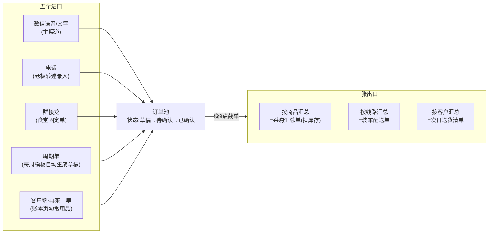

# 07-电脑端方案与对账中心

**这篇解决什么问题:** 三件事。①产品不能只有手机小程序,**电脑端也必须有**——给出双端方案与分工;②把**需求(订单)怎么汇集**从进口到出口讲成一条看得见的链;③**对账是重中之重**——对照 design/05 修订后的设计再核查一遍,列出已达标项与新发现的缺口,并把"做到什么程度"定成可验收的硬标准。本篇与 design/05 口径一致,涉及 02/06 的增补见文末工单。

---

## 一、双端形态:手机干"跑"的活,电脑干"坐"的活

### 1. 为什么必须有电脑端

看这门生意一天的分工就明白:老板在外面跑(市场、送货、见客户),手机合适;**老板娘在店里坐着干的活**——晚上集中录单、下午记款销账、月初对账打印、导 Excel——在 6 英寸屏幕上戳,是折磨。尤其两件事,电脑有压倒性优势:

- **贴单**:微信电脑版和工作台并排开,左边复制聊天记录、右边粘贴拆单,比手机上切来切去顺十倍;
- **对账与打印**:月初几十户对账单,逐户核对、批量打 A4、导 Excel,天然是电脑活。

### 2. 两层方案:先零成本"有",再真做一个工作台

**第一层(M1 即有,零额外开发):微信电脑版直接跑小程序。** 微信 Windows/Mac 客户端本身支持窗口化运行小程序——同一个小程序、同一个账号,在电脑上点开就能用,还能和聊天窗口并排。设计上只需两条要求:①关键页面(贴单、记款、对账、客户列表)自适应大窗口,不出现手机竖条居中两边留黑;②输入框支持键盘粘贴与回车提交。这一层让"电脑端有没有"在 MVP 就是"有"。

**第二层(M2 交付):浏览器 PC 工作台。** 独立 Web 页面,微信扫码登录(同一账号体系、同一后端 API,Web 只是另一层界面,不重复实现业务逻辑)。**只做四件坐着干的事**:

| PC 工作台四大件 | 内容 |
|---|---|
| ① 贴单中心 | 大文本框整晚聊天记录一次粘贴→拆单预览(每单一卡)→逐单确认/修改→批量生效 |
| ② 对账中心 | 本篇第三节详述——月初全户对账一屏处理 |
| ③ 记款与核销 | 批量记收款、凑整款分配调整(payment_allocation 可视化:左边收款、右边挂账单,连线即分配) |
| ④ 打印与导出 | A4 对账单/回执台账批量打印(浏览器打印,沿用 templates/print 版式)、全量 Excel 导出 |

**不做**:配送、拍照、路线——移动场景不搬上桌面;也不做"电脑端独有功能",防止两端功能漂移(所有能力手机端都有,电脑端只是更顺手)。

### 3. 端与角色分工表

| 设备 | 谁用 | 干什么 | 何时 |
|---|---|---|---|
| 手机小程序 | 老板 | 看三个数字、确认订单、催款、临时记款 | 全天在外 |
| 手机小程序 | 配送员 | 路线导航、拍回执、差异闸门 | 上午配送 |
| 微信电脑版跑小程序(M1) | 老板娘 | 贴单、记款、看账 | 晚间/下午在店 |
| PC 工作台(M2) | 老板娘 | 四大件(贴单/对账/核销/打印导出) | 晚间集中+月初 |
| 客户微信(零安装) | 饭店老板 | 发语音下单、查"我的账本"、月度对账表态 | 随时 |

### 4. 技术要点(给工程师的边界)

- Web 登录:小程序扫码→云函数签发短期 token,角色权限与小程序完全同源(配送员账号无法登录 PC 工作台);
- 同一后端:PC 端不新增任何业务接口语义,只允许"批量包装"既有接口(如批量确认=循环调用单笔确认,服务端保证逐笔幂等);
- 打印即浏览器打印:不做打印插件、不做导出 PDF 服务端渲染,A4 版式用打印 CSS(与 templates/print 同源);
- 数据一致:两端同账号同数据,不存在"PC 数据""手机数据"之分——任何页面数字均来自同一 customer_balance / statement。

---

## 二、需求汇集:五个进口、一个池子、三张出口

订单(客户需求)的汇集是全系统的进水口,链路必须一眼看清:

### 1. 五个进口,各自的规矩

- **微信语音/文字(占大头)**:走 design/05 包2 的批量贴单——晚上集中转文字、复制,贴单中心一次粘贴、按客户拆单、常用品对照表翻译("一件醋"→具体品规格)、拿不准标红;PC 上这条路最顺。
- **电话**:挂电话前复述一遍(docs/02 铁律),随手在手机端手点九宫格开单——电话单不过夜。
- **群接龙**:食堂档口每周固定单,接龙结果结构化导入为已确认订单(M2)。
- **周期单**:客户档案里标记"每周二 固定单模板",系统到点自动生成**草稿**进池,老板确认才生效——自动生成、人工放行,不替客户做主。
- **客户端"再来一单"**:点过卡片的客户,在"我的账本"页可按上次/常用品勾选提交,进池为**待确认草稿**。注意定位:不是要改变"微信下单"习惯,是给年轻店员/酒楼采购多一条自助路;老客户照旧发语音,一切照旧。

### 2. 一个池子:进口必进池,池中必有状态

所有渠道的单,不论来源,一律落进同一个订单池,状态机只有一条:**草稿→待确认→已确认→已配送→已签收**(作废单留痕)。两条铁规:

- **漏单率必须为 0 的机制**:凡进池必有状态;截单时刻(晚9点)一到,池里还有"草稿/待确认"的单,首页强提醒直到清零——单可以不接(作废),不允许"忘了";
- **来源留痕**:每单记 source(voice/phone/接龙/周期/自助)与原文(raw_text),争议可回溯。

### 3. 三张出口:一次截单,三种视图

截单后同一份数据出三张单,全部机器生成、秒级出:**按商品**汇总扣掉现有库存=采购汇总单(清晨带去市场);**按线路**=装车配送单(配送员的今日任务);**按客户**=次日送货清单(备货核对)。人不做任何汇总计算——这正是 docs/03 里老板清晨拿计算器干半小时的活。

### 4. 做到什么程度(需求汇集的验收线)

| 指标 | 标准(示例) |
|---|---|
| 漏单 | 0——截单强提醒机制下,池内无无状态单 |
| 贴单拆单准确率 | ≥90% 且"错归客户"=0(M0 ②已设打靶) |
| 三张出口生成时间 | ≤3秒 |
| 晚间批处理 | 30单10分钟内确认完(含改红格) |
| 周期单 | 到点生成草稿准时率100%,老板未放行不生效 |

---

## 三、对账中心再核查:六项已达标,六个缺口补上

### 1. 核查结论:design/05 修订后已达标的六项

| # | 已达标项 | 出处 |
|---|---|---|
| 1 | statement 幂等生成((tenant, customer, period) 唯一键,重跑不重复) | 05包5 |
| 2 | 快照冻结与"快照后已收"分离展示,确认的数永远是确定的数 | 05包5 |
| 3 | 主机制"7天内未提异议视为无误",按钮【看过了,没问题】只是加分 | 05包5 |
| 4 | 异议3步内定位到当日签字回执照片 | 05包3/5 |
| 5 | payment_allocation 收款分配(FIFO自动+老板可调),账龄可算 | 05包5 |
| 6 | customer_balance 物化余额+夜间全量重算校验,不平即报警;流水只追加不删改 | 05包5 |

### 2. 核查发现的六个缺口与补法

**缺口① 期初建账——最大的洞。** 全部设计都从"系统里开始记账"讲起,但上线那天,每个客户手里都压着**历史欠款**。老账不进系统,第一张对账单的"期初欠款"就是空口白话,客户第一反应就是"你这数哪来的"——对账体系在第一个月就失去公信力。**补法**:开店引导补第四步"理老账":逐户录入期初欠款→生成**期初确认单**(单号 QC+日期+客户序号,可打印A4/可发卡片,附一句"以此为起点,以后每一笔都有签字单")→客户签字或卡片确认或7天默认→期初数进入第一期 statement 的 opening_balance,且此后不可改(改动走调整分录)。**没有期初确认,对账中心等于建在沙子上,此项列为 M1 P0。**

**缺口② 结算周期只有月。** statement 只按自然月生成,但 docs/05 明确 B 类客户是周结/半月结。**补法**:customer 增加 settle_cycle(后经《design/08》扩为**日/周/半月/月四档**,日结户当晚自动出当日结算单),分片任务按各自周期生成;另加**任意区间即时对账单**——老板上门收款前,点客户→【出一张截至今天的账】,3秒生成(快照同样落 statement,period 记区间),当面对当面收。对账与结算的概念拆分(事实天天清、钱按周期收)详见《design/08》第四节。

**缺口③ 调整与预收的呈现无规范。** adjust 分录和多付的钱在对账单上怎么显示,没定——客户看到一行来历不明的"调整 -¥55"必起疑。**补法**:对账单明细行只有四种类型,每种有固定话术:送货(+,附回执号)/收款(-,附日期方式)/调整(±,**必附原因与经手人**,如"7月12日破损1桶,王老板与李师傅当场核定")/预收结转(期末为负时显示"您多付 ¥X,下期自动抵扣")。

**缺口④ 收款约定没有落点。** docs/05 的线下流程里"对完账约定付款日"是关键动作,系统里没有字段承接。**补法**:statement 增加 promised_pay_date(客户确认时可选填/老板补填),到期未收自动进首页"该催的账",催款话术自动带上"您说好本周结的"。

**缺口⑤ 没有 PC 对账中心。** 每晚按户对日账、月初结算,都是典型的"坐着干的活",手机逐户点是折磨。**补法(M2,PC 工作台核心页)**:对账中心**首页即"今日对账工作台"**(《design/08》四.2:当日有单客户列表状态灯→逐户核对 N 笔+回执照片流→行级打折/减免/退货必附原因→生成日账单 RZ 一键发客户);另含结算单列表视图(状态列:已确认/默认生效/有异议/未触达/到期未收),支持批量打印A4、批量导出、一键生成今日待转发;点任一户进**逐户核对页**:左侧单、右侧回执照片流滚动比对;异议单独一个处理队列,处理完自动回写。验收线:日对账20户≤30分钟、本店23家月结户月初处理完≤2小时(均示例)。

**缺口⑥ 单据编号与纸电同源。** 对账单没有单号,A4、卡片、Excel 三种形态无法互相指认。**补法**:对账单号 DZ+期间+客户序号(如 DZ202607-012);三种输出渲染自同一 statement 快照,单号一致、金额一致——客户拿着打印件打电话来,报单号即可对上电子记录。

### 3. 对账全链路(补完缺口后的完整闭环)

链上每个节点都有凭据、都有留痕、都可回溯——这就是"对账是重中之重"落到系统里的样子:**它不是一个页面,是一条从期初到收款的证据链。**

---

## 四、对账"做到什么程度":验收标准

### M1 底线(全过才许说"对账功能完成")

| # | 标准 | 怎么验 |
|---|---|---|
| 1 | 全部月结客户对账单每期自动生成,零手工翻单 | 本店自然月实测 |
| 2 | 任一明细3步内见到签字回执照片 | 抽任意10笔实测 |
| 3 | 期初确认闭环:每户有期初确认记录(签字/卡片/7天默认三者之一) | 全客户核查 |
| 4 | 纸电同号同数:A4打印件与卡片、导出Excel金额与DZ单号一致 | 抽5户三态比对 |
| 5 | 表态留证:确认(openid+时间戳)或默认生效记录,事后可出示 | 后台取证演练 |
| 6 | 夜间重算连续两周零报警;人为造一笔错账,当夜必报警 | 故障注入测试 |

### M2 增强

| # | 标准 | 怎么验 |
|---|---|---|
| 7 | PC 对账中心:23家月结户月初处理完≤2小时(示例) | 本店实测计时 |
| 8 | 任意区间即时对账单≤3秒,上门收款场景可用 | 现场实测 |
| 9 | 异议闭环≤48小时,全程留痕(提出→定位→调整→回复) | 演练+台账 |
| 10 | 到期未收自动进"该催的账",无一漏网 | 造数验证 |
| 11 | 日对账闭环:每晚今日对账工作台核对+调整+发出,20户≤30分钟、发送率100%;结算单争议率≈0(《design/08》四) | 本店连续一个月台账 |

### 工程铁律(对账代码的特殊纪律)

- **金额一律以"分"为单位整数存储**,任何浮点运算禁止进账务路径;
- 账务核心函数(分配、汇总、快照、重算)**单元测试覆盖100%**,每次发版全量回归;
- 任何页面上的任何金额,必须能在5分钟内用流水人工复算验证——复算不出来的数字不许上屏。

**北极星**:月底对账从3天→半天→1小时;任何一笔账,3步之内见到签字照片;客户从"怕对账"变成"等对账"。

---

## 五、增补工单(落到既有文档)

| 文件 | 改什么 |
|---|---|
| design/02 数据模型 | customer 加 settle_cycle;statement 加 promised_pay_date、statement_no(DZ规则)、支持区间期;新增期初确认(QC单)实体或并入 statement 首期;调整分录强制 reason+operator 字段 |
| design/01 | 开店引导补第四步"理老账";新增屏:PC 工作台四大件、逐户核对页、即时对账单入口;对账卡明细行四类型话术 |
| design/06 | 新增模块14"PC 工作台"(P1,M2);模块2 开店引导加期初确认(P0);模块10 补:期初确认、settle_cycle、promised_pay_date、DZ单号、即时对账单(P0/P1 见工单);M1 门禁并入本篇四.M1 六条;M2 门禁并入四.M2 四条 |
| design/05 验证清单 | 加一行:期初确认闭环率(假设:上线首月100%客户完成期初确认;验证:样板店实测;B计划:未确认客户首期对账单标注"期初数以门店记录为准,有异议请7日内提出") |

---

**一句话压住本篇**:电脑端分两层——微信电脑版跑小程序让 M1 就"有",M2 的 PC 工作台专干贴单、对账、核销、打印四件坐着的活;需求汇集是"五进口一池三出口",铁规是进口必进池、截单必清零;对账补上期初建账、周期粒度、行类型规范、收款约定、PC 工作台、纸电同号六个缺口后,才配得上"重中之重"四个字——它的完成标准不是页面做出来,而是四.里那十条全部验收过。
