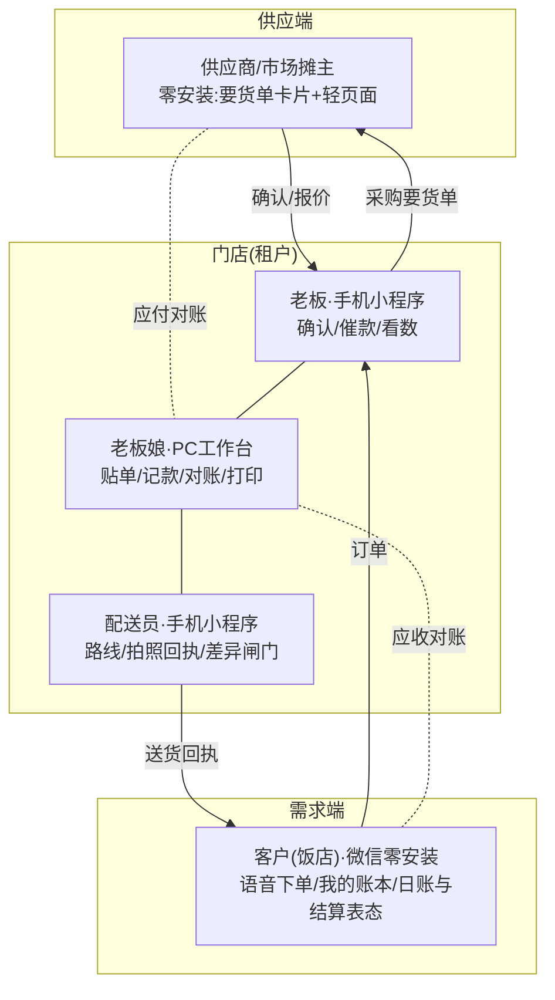

# 08-四方协同与日清结算

**这篇解决什么问题:** 方案持有者定了两条新方向。①**四方都用我们的界面**:配送员的拍照回执、老板娘的电脑工作台之外,**供应商(市场摊主)也可以用,客户也在用——四方的操作都走我们的界面和接口,所有数据汇集起来统一处理分析**;②**对账每天都做**:对账不是月底的事,是每天的事;而**结账(收钱)的周期每家不一样**——最好每天都结,大公司客户可以月结。本篇给出四方协同的设计、数据汇集与分析的分层,以及"日清对账+按户结算"的模型修订。与 design/05/07 冲突处以本篇为准,增补工单见文末。

---

## 一、四方角色全景:每个动作都在系统里发生

平台的完整形态:**围绕一家配送门店,四方角色各有各的界面,每个业务动作都通过我们的界面完成,因此每个动作都变成一条数据**。

| 角色 | 界面形态 | 核心动作 | 汇集到的数据 |
|---|---|---|---|
| 老板 | 手机小程序 | 确认订单、催款、临时记款 | 订单流、决策留痕 |
| 老板娘 | PC 工作台(+微信电脑版) | 贴单、记款、对账、打印导出 | 账务流、结算流 |
| 配送员 | 手机小程序(仅路线+拍照) | 导航、拍回执、差异闸门 | 履约流、签收凭据、差异记录 |
| 客户(饭店) | 微信零安装(卡片+账本页) | 发语音下单、查账、日账/结算表态 | 需求流、确认留证 |
| 供应商(摊主) | 微信零安装(卡片+轻页面) | 收要货单、确认/改量、报今日价 | 供给流、进价行情 |

四方闭环意味着:**需求(客户要什么)→ 履约(送了什么、谁签的)→ 资金(谁欠谁多少)→ 供给(进价多少、哪家供的)**,全链路每一环都有结构化数据,这是"统一处理分析"的地基。

## 二、供应商端设计:客户端模式反着用一遍

### 1. 定位先说死

供应商端是**门店自己的采购协同与应付记账工具**,服务的是门店和它既有的熟人摊主——**不是撮合平台**:不帮门店找新供应商、不碰交易、不抽佣,design/03 第六节的四不做一条不破。

### 2. 核心洞察:应收与应付是同一套引擎的镜像

门店对客户:送货挂账(应收+)→ 收款核销(应收-)→ 周期结算单。
门店对供应商:进货挂账(应付+)→ 付款核销(应付-)→ 周期结算单。
**同一套账务引擎(挂账/核销/分配/快照/对账),方向相反,完全复用**——工程上把 ledger 抽象出 direction(receivable/payable),挂账凭据从"送货回执"换成"采购签收",其余机制(FIFO 分配、物化余额、夜间重算、只追加不删改、DZ 单号)原样继承。对账这个"重中之重"投入的每一分钱,自动在供应端产生第二次回报。

### 3. 供应商端流程(零安装,和客户端同一套路)

1. **要货单卡片**:清晨采购汇总单生成后,按供应商拆分,一键发给各摊主微信:"今晨要货:黄豆酱油×4桶、陈醋×2件"——摊主提前备好,门店到摊即取,市场里省下的是排队和现挑的时间;
2. **确认与改量**:摊主点卡片进轻页面,【都有货】一键确认;缺货改量、点一下"今日价"报价(日牌价反向:摊主报进价行情);
3. **采购签收**:门店在摊位收货,老板手机端对该摊主订单点【收到】(±改量),等价于"反向差异闸门"——现结的当场记付款,赊的自动挂应付;
4. **应付对账**:摊主月底(或双方约定周期)收到门店发的**应付结算单**,和客户端对账卡同构;摊主也能随时点开"我的账"看门店欠自己多少——**门店给客户的透明,供应商同样享受**,这是让摊主愿意配合使用的理由。

### 4. 分期与克制

- **M3 起步(P2)**:要货单卡片+摊主确认+应付挂账/付款记账/应付结算单(引擎复用,增量开发量小);
- **远期**:摊主报价沉淀进价行情、多摊主比价提示;
- **不做**:摊主的库存管理、摊主对其上游的账——我们只管"门店与摊主之间"这一段。

## 三、数据汇集与统一分析:三层,一层比一层慎重

四方数据汇进同一个池子后,分析按三层展开。原 design/06 模块13 说"别给老板长出经营分析"——那是防 MVP 做过头;现在方向已定,修订为**分层分期做,每层有边界**:

| 层 | 内容 | 给谁看 | 期次 | 边界 |
|---|---|---|---|---|
| L1 台账与日报 | 今天收的钱/欠款/要送的家数、晚间日报 | 老板 | M1(已有) | 只陈述事实,零分析 |
| L2 门店经营分析 | 客户贡献榜与流失预警(常订客户断订提醒)、商品动销与毛利(进价来自采购数据,自动算)、账龄趋势、**结算周期健康度**(见第四节)、供应商进价走势 | 老板/老板娘 | M3 | 只分析本店自己的数据;每张图配一句"人话结论"(如"老王家两周没订货了,该去看看"),不堆图表 |
| L3 跨店聚合行情 | 本市/本区域品类批发价格指数、需求趋势(如"本月县城烧烤店孜然用量涨三成") | 参与门店共享 | 远期 | **红线**:仅脱敏聚合、门店明示授权(opt-in)才参与、任何单店数据不可反推;"数据主权归门店"的承诺(design/02)不因聚合而破——不授权不参与,不参与不影响任何已有功能 |

工程上的准备(M1 就要埋对):所有业务表带规范化的品类/规格编码(模块3 的品类树不只是展示,是分析的维度基础);金额、数量、日期字段口径统一——**汇集数据的能力是 M1 建表时决定的,不是 M3 加报表时决定的**。

## 四、三个活分清楚:签收、日对账、结清

这三件事是**三个不同的活、三个不同的人、三个不同的时点**,系统必须分开对待:

| 活 | 谁干 | 何时 | 产出 | 性质 |
|---|---|---|---|---|
| **签收** | 配送员 | 送达当场 | 签字回执(HZ 单号,单笔) | 交付凭据 |
| **日对账** | 老板娘 | 每晚 | 日账单(RZ 单号,按户汇总当天全部订单+折扣调整),微信发客户确认 | 核对事实 |
| **结清** | 老板/老板娘 | 按户周期+持续 | 结算单(DZ 单号)+收款跟踪+催款 | 把钱收回来 |

(修正本篇初稿"当日回执=当日对账"的说法:**回执只是日对账的原材料,对账是老板娘的独立日终动作**——因为一天可能送多次、还要处理折扣,拍照那一刻定不了当天的账。)

### 1. 签收:配送员只管交付凭据

拍照签字回答三件事:这单送到了、谁收的、当场有无改动(差异闸门)。状态止于"已签收",**不产生对外的"账"**。电子回执卡照发(单笔凭据留存+员工监督钩子),但脚注改为"**当日金额以晚间对账单为准**"——现场折扣还没发生,单笔卡片不承诺当天总账。

### 2. 日对账:老板娘的日终工作流(系统的核心页面)

一天可能给同一家送两三次(早上正常单、中午紧急补单),有的货到店发现不新鲜、破损、短量要给折扣——**当天的账必须由人过一遍再定**。老板娘每晚打开"今日对账"工作台(PC 对账中心首页,微信电脑版/手机可用):

1. **一屏总览**:当天有送货的客户列表,每户状态灯:待核对→已发送→已确认/有异议;差异闸门标记的单置顶提示;
2. **逐户核对**:点开一户,当天全部订单(N笔)+回执照片流并排;
3. **折扣与调整**(本工作流的灵魂):行级三个操作【打折】【减免】【退货】,**必附原因**(不新鲜/破损/短量/人情价),生成调整分录(原因+经手人,行类型规范见《design/07》三.缺口③)——豆腐坏了两块钱、白菜蔫了打八折,都在这一步落成白纸黑字;
4. **生成日账单**(单号 RZ+日期+客户序号):当天逐笔(含调整行)+当日合计+截至今日累计欠款,快照幂等((tenant, customer, date) 唯一);
5. **一键发客户**:微信卡片(正面脱敏)逐户发出或进"今日待转发";客户点【没问题】1步确认,或点某笔看回执照片提异议;
6. **默认与闭环**:次日晚8点前未回应视为无误(留证);异议当天/次日处理——**当天的事趁热对,过了月翻旧账才吵架**;全部户"已发送"即今日对账完成,系统记录每户发送率/确认率。

**工作量目标(示例)**:20户当日单,核对+调整+发出 ≤30分钟;无折扣的户支持"一键按原单生成并发送"批量处理,有异常的户才逐户进。

### 3. 结清:收款是场持久战,系统当军师

账对清了,钱不一定回得来——对方老板资金有状况、性格各不同,**收款要持续跟踪,还要看人下菜**。设计三件套:

**① 收款跟踪状态机**:结算单(按户周期:日/周/半月/月,快照/DZ 单号/机制不变)发出后进入跟踪:待收→已承诺(promised_pay_date)→部分收→拖延→收清;每张结算单的钱走到哪一步,首页"该催的账"一眼可见。

**② 客户付款画像(customer_payment_profile)**:两类信息合成——
- 系统自动算的:历史平均回款天数、承诺兑现率(说好周五结,几次真结了)、常见付款时点(月初/发薪后/逢集);
- 老板手工点选的标签:性格(爽快/要面子/爱拖/哭穷)、实际管钱人(老板/老板娘/会计)、禁忌(别当员工面提钱、别在饭口打电话)。

**③ 军师式催款建议引擎**(M3 起步为规则引擎):输入=欠款额、账龄、承诺状态、画像、历史催收反应;输出=**时机+方式+话术**三件事,例如:
- "张老板**要面子**:别发文字,明早送货时**当面顺嘴**提一句,话术:'张哥,上月那三千六,您看这两天方便不'";
- "李老板**承诺兑现率30%**:这次必须约到具体日子,当场记进系统,到期头天再提醒一次";
- "超60天+**哭穷型**:建议周五**上门**,带打印对账单,目标先收一半、剩下签还款日——话术已备三条,选一条改改再发"。

**铁律不破**:系统只出主意、备话术,**发不发、催不催、给不给面子,永远老板点头**(docs/10 边界"催款只提示不自动发"在此完整继承);每次催收记 collection_log(方式/内容/对方反应/结果),反哺画像——承诺兑现率越算越准,军师越当越像样。远期可用大模型按画像生成个性化话术(只用本店数据,列远期不承诺)。

**引导往短周期迁**:"最好每天都结"落成产品机制——结算周期健康度指标(L2 分析):月结占比、平均资金占压天数;新客户默认从日结/周结起步,信用攒够再谈月结(与 docs/05 信用分级联动);老客户迁移话术:"咱账天天都是清的,改成一周一结,你我都省心"。

### 4. 模型落点(数据与文档口径修订)

- **三层单据链**:回执(HZ,单笔交付凭据)→ 日账单(RZ,当日按户汇总,**确认的主战场**)→ 结算单(DZ,周期请款,聚合已确认日账单)——**结算争议率≈0** 的靶保持:结算单上不许出现客户第一次见到的数字,若结算还有争议,修的是日对账环节;
- statement 体系统一:日账单=period 为"日"的快照,结算单聚合已确认日账;customer.settle_cycle 四档;
- 新增 customer_payment_profile、collection_log 两实体;
- 客户账本页信息架构:"日账单流(按日)+ 结算单列表+当前欠款"三段;
- 供应商侧同构:supplier.settle_cycle 同四档,应付结算单同引擎(应付侧无需催款军师);
- 06/07 中"当日回执=当日对账"的表述废止,以本节三段模型为准。

## 五、增补工单

| 文件 | 改什么 |
|---|---|
| design/02 数据模型 | ledger 抽象 direction(receivable/payable);新增 supplier、purchase_receipt(采购签收)、payable 侧流水与结算单(复用引擎);settle_cycle 四档(含日结);statement 支持日周期(RZ 日账单)并由结算单聚合;新增 customer_payment_profile(付款画像)、collection_log(催收留痕);分析维度编码规范(品类树编码进所有单据行) |
| design/06 | 新增模块15"供应商端"(P2,M3);模块10 改三层单据链(HZ→RZ→DZ),**"今日对账工作台"列 P0**(折扣调整/批量发送/默认闭环);模块9 加收款跟踪状态机(P1)与付款画像+军师建议引擎(P2);模块13 补 L2 经营分析;模块14 对账中心首页即今日对账工作台;时间线 M3 范围补供应商端与军师引擎 |
| design/07 | 对账中心首页改为"今日对账工作台";验收标准加"结算争议率≈0"、20户30分钟(示例)与日清闭环检查 |
| design/01 | 新增屏:今日对账工作台(老板娘,含折扣三操作)、催款军师卡(时机/方式/话术三选一);客户账本页改"日账单流+结算单+当前欠款"三段;电子回执卡脚注改"当日金额以晚间对账单为准";供应商端轻页面两屏(M3 前补) |
| docs/05 | 对账一节按"签收/日对账/结清"三段模型改写制度说明,纸质流程同样适用(回执是凭据、晚间按户汇总对账、结算只请款不对数);催款一节增补付款画像与看人下菜三例 |

---

**一句话压住本篇**:四方(店、员、客、供)每个动作都在系统里发生,数据才汇得齐;汇齐的数据分三层用(日报→本店分析→授权聚合行情),一层比一层慎重;账的事拆成三个活——**配送员签收留凭据,老板娘每晚按户汇总打折扣、微信发客户对日账,钱按户的周期收并由系统当军师看人下菜地催**;结算单上不许出现第一次见到的数字,应收引擎反向复用就是应付,对账这件重中之重的投入在四方每一边都赚一次。
