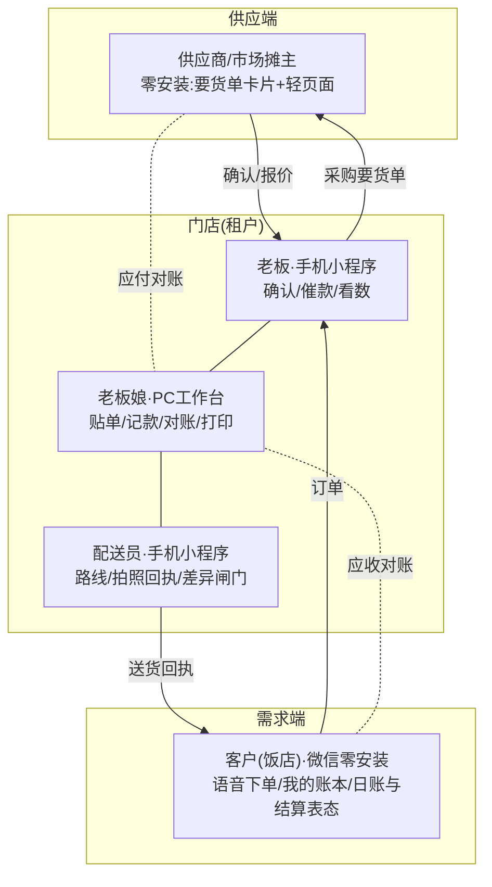

# 08-四方协同与日清结算

**这篇解决什么问题:** 方案持有者定了两条新方向。①**四方都用我们的界面**:配送员的拍照回执、老板娘的电脑工作台之外,**供应商(市场摊主)也可以用,客户也在用——四方的操作都走我们的界面和接口,所有数据汇集起来统一处理分析**;②**对账每天都做**:对账不是月底的事,是每天的事;而**结账(收钱)的周期每家不一样**——最好每天都结,大公司客户可以月结。本篇给出四方协同的设计、数据汇集与分析的分层,以及"日清对账+按户结算"的模型修订。与 design/05/07 冲突处以本篇为准,增补工单见文末。

---

## 一、四方角色全景:每个动作都在系统里发生

平台的完整形态:**围绕一家配送门店,四方角色各有各的界面,每个业务动作都通过我们的界面完成,因此每个动作都变成一条数据**。

| 角色 | 界面形态 | 核心动作 | 汇集到的数据 |
|---|---|---|---|
| 老板 | 手机小程序 | 确认订单、催款、临时记款 | 订单流、决策留痕 |
| 老板娘 | PC 工作台(+微信电脑版) | 贴单、记款、对账、打印导出 | 账务流、结算流 |
| 配送员 | 手机小程序(仅路线+拍照) | 导航、拍回执、差异闸门 | 履约流、签收凭据、差异记录 |
| 客户(饭店) | 微信零安装(卡片+账本页) | 发语音下单、查账、日账/结算表态 | 需求流、确认留证 |
| 供应商(摊主) | 微信零安装(卡片+轻页面) | 收要货单、确认/改量、报今日价 | 供给流、进价行情 |

四方闭环意味着:**需求(客户要什么)→ 履约(送了什么、谁签的)→ 资金(谁欠谁多少)→ 供给(进价多少、哪家供的)**,全链路每一环都有结构化数据,这是"统一处理分析"的地基。

## 二、供应商端设计:客户端模式反着用一遍

### 1. 定位先说死

供应商端是**门店自己的采购协同与应付记账工具**,服务的是门店和它既有的熟人摊主——**不是撮合平台**:不帮门店找新供应商、不碰交易、不抽佣,design/03 第六节的四不做一条不破。

### 2. 核心洞察:应收与应付是同一套引擎的镜像

门店对客户:送货挂账(应收+)→ 收款核销(应收-)→ 周期结算单。
门店对供应商:进货挂账(应付+)→ 付款核销(应付-)→ 周期结算单。
**同一套账务引擎(挂账/核销/分配/快照/对账),方向相反,完全复用**——工程上把 ledger 抽象出 direction(receivable/payable),挂账凭据从"送货回执"换成"采购签收",其余机制(FIFO 分配、物化余额、夜间重算、只追加不删改、DZ 单号)原样继承。对账这个"重中之重"投入的每一分钱,自动在供应端产生第二次回报。

### 3. 供应商端流程(零安装,和客户端同一套路)

1. **要货单卡片**:清晨采购汇总单生成后,按供应商拆分,一键发给各摊主微信:"今晨要货:黄豆酱油×4桶、陈醋×2件"——摊主提前备好,门店到摊即取,市场里省下的是排队和现挑的时间;
2. **确认与改量**:摊主点卡片进轻页面,【都有货】一键确认;缺货改量、点一下"今日价"报价(日牌价反向:摊主报进价行情);
3. **采购签收**:门店在摊位收货,老板手机端对该摊主订单点【收到】(±改量),等价于"反向差异闸门"——现结的当场记付款,赊的自动挂应付;
4. **应付对账**:摊主月底(或双方约定周期)收到门店发的**应付结算单**,和客户端对账卡同构;摊主也能随时点开"我的账"看门店欠自己多少——**门店给客户的透明,供应商同样享受**,这是让摊主愿意配合使用的理由。

### 4. 分期与克制

- **M3 起步(P2)**:要货单卡片+摊主确认+应付挂账/付款记账/应付结算单(引擎复用,增量开发量小);
- **远期**:摊主报价沉淀进价行情、多摊主比价提示;
- **不做**:摊主的库存管理、摊主对其上游的账——我们只管"门店与摊主之间"这一段。

## 三、数据汇集与统一分析:三层,一层比一层慎重

四方数据汇进同一个池子后,分析按三层展开。原 design/06 模块13 说"别给老板长出经营分析"——那是防 MVP 做过头;现在方向已定,修订为**分层分期做,每层有边界**:

| 层 | 内容 | 给谁看 | 期次 | 边界 |
|---|---|---|---|---|
| L1 台账与日报 | 今天收的钱/欠款/要送的家数、晚间日报 | 老板 | M1(已有) | 只陈述事实,零分析 |
| L2 门店经营分析 | 客户贡献榜与流失预警(常订客户断订提醒)、商品动销与毛利(进价来自采购数据,自动算)、账龄趋势、**结算周期健康度**(见第四节)、供应商进价走势 | 老板/老板娘 | M3 | 只分析本店自己的数据;每张图配一句"人话结论"(如"老王家两周没订货了,该去看看"),不堆图表 |
| L3 跨店聚合行情 | 本市/本区域品类批发价格指数、需求趋势(如"本月县城烧烤店孜然用量涨三成") | 参与门店共享 | 远期 | **红线**:仅脱敏聚合、门店明示授权(opt-in)才参与、任何单店数据不可反推;"数据主权归门店"的承诺(design/02)不因聚合而破——不授权不参与,不参与不影响任何已有功能 |

工程上的准备(M1 就要埋对):所有业务表带规范化的品类/规格编码(模块3 的品类树不只是展示,是分析的维度基础);金额、数量、日期字段口径统一——**汇集数据的能力是 M1 建表时决定的,不是 M3 加报表时决定的**。

## 四、对账模型升级:对账天天做,结算按户来

### 1. 把两个概念拆开

原设计把"对账"和"收钱"绑在一张月度对账单上。现在拆开:

- **对账 = 核对事实**("昨天送了什么、多少钱、谁签的")——**每天都做**;
- **结算 = 请款收钱**("这一期该结我多少")——**按户设周期**:日结/周结/半月结/月结。

拆开后各自都变简单:事实每天核对,新鲜、量小、有签字照片,没什么可吵的;结算单只是把**已经双方认过的日账**加起来请款——**结算单上不该再出现第一次见到的数字**,这是本节全部设计的靶心。

### 2. 日清对账:当日事当日毕

- **当日即对**:配送员拍照签字回执,那一刻这笔账的"事实"已双方确认——日清的主体动作在 M1 已存在,本节把它升格为制度:**当日回执 = 当日对账**;
- **日账呈现**:客户"我的账本"页按日分组、每日小计;当天送完货,客户点开看到"今天:3笔 ¥345,签收:小李",配一排回执照片;
- **日账异议窗口**:鼓励当日提、最迟 7 天(与 05 的默认机制一致)——当天的事当天说得清,过了月再翻旧账才吵架;
- **门店晚间日结**(docs/05 已有的 10 分钟日结)增加一项:扫一眼"今日各户日账"列表,异常(有改动、拒收)是否都已闭环——**门店内部日清 + 客户侧日清,两边每天归零**。

### 3. 按户结算:settle_cycle 四档

| 档 | 适用 | 机制 |
|---|---|---|
| **日结** | 现金流好的小店、新客户、信用观察期客户 | 当天送完,晚间自动生成当日结算单(就是日账+请款),当天或次日收 |
| 周结/半月结 | 多数 B 类小饭店 | 周期末自动汇总已确认日账生成结算单 |
| 月结 | A 类大户:酒店、单位食堂、大公司客户 | 月初生成月结算单;对公转账、要发票的走各自流程,收款约定(promised_pay_date)跟踪 |

- **引导往短周期迁**:"最好每天都结"落成产品机制——**结算周期健康度**指标(L2 分析):应收总额中月结占比、平均资金占压天数;新客户默认从日结/周结起步,信用积累后再谈月结(与 docs/05 信用分级联动);老客户迁移靠话术模板("咱账天天都是清的,要不改成一周一结,你我都省心");
- **结算单的验收标准升级**(在 design/07 四.基础上加一条):**结算争议率≈0**——因为每笔都在日清时确认过,结算单若还有争议,说明日清环节漏了,要修的是日清,不是结算单。

### 4. 模型落点(数据与文档口径修订)

- customer.settle_cycle 四档(日/周/半月/月);statement 概念更名为**结算单**,按户周期生成,快照/幂等/DZ 单号/收款约定机制不变;"对账"一词此后指日清动作;
- 客户账本页信息架构改为"日账流(按日分组)+ 结算单列表"两段;
- 供应商侧同构:supplier.settle_cycle 同四档,应付结算单同引擎。

## 五、增补工单

| 文件 | 改什么 |
|---|---|
| design/02 数据模型 | ledger 抽象 direction(receivable/payable);新增 supplier、purchase_receipt(采购签收)、payable 侧流水与结算单(复用引擎);settle_cycle 四档(含日结);分析维度编码规范(品类树编码进所有单据行) |
| design/06 | 新增模块15"供应商端"(P2,M3:要货单卡片/摊主确认报价/采购签收/应付账);模块13 验证埋点之外增补 L2 经营分析(P2,M3)并修订"最容易做过头"表述为"L2 每图配人话结论,L3 未经授权不做";模块10 术语改"结算单",增加日结档与"结算争议率≈0"验收;时间线 M3 范围补供应商端起步 |
| design/07 | 对账中心工作台增加"今日各户日账"视图;验收标准加"结算争议率≈0"与日清闭环检查 |
| design/01 | 客户账本页改"日账流+结算单"两段式;新增供应商端轻页面两屏(要货单确认、我的账)规格(M3 前补) |
| docs/05 | "月结对账流程"一节增补"日清对账+按户结算"制度说明,纸质流程同样适用(当日回执当日核,结算单只请款不对数) |

---

**一句话压住本篇**:四方(店、员、客、供)每个动作都在系统里发生,数据才汇得齐;汇齐的数据分三层用(日报→本店分析→授权聚合行情),一层比一层慎重;对账与结算拆开——**事实天天清(日清),钱按户的周期收(日结到月结)**,结算单上不许出现第一次见到的数字,应收引擎反向复用就是应付,对账这件重中之重的投入在四方每一边都赚一次。
